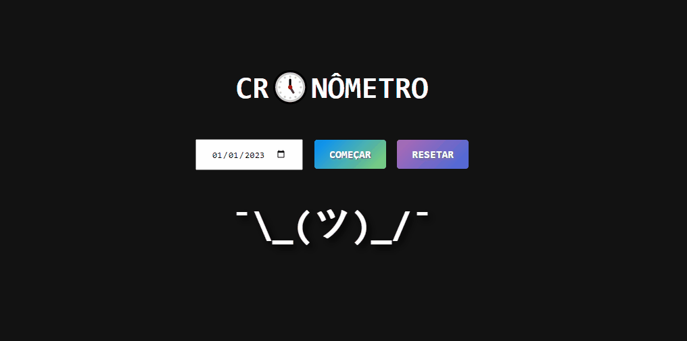

<h1 align='center'>
Stopwatch
</h1>

<h1 align='center'>
  
</h1>
<h1 align='center'><a href="">See the site</a></h1>

## 📕 About

A stopwatch is a timepiece designed to measure the amount of time that elapses between its activation and deactivation.

## 🔨 Tools

- HTML
- CSS
- JavaScript

## 🧾 License

This project is under the MIT License. See the file LICENSE for more details.

